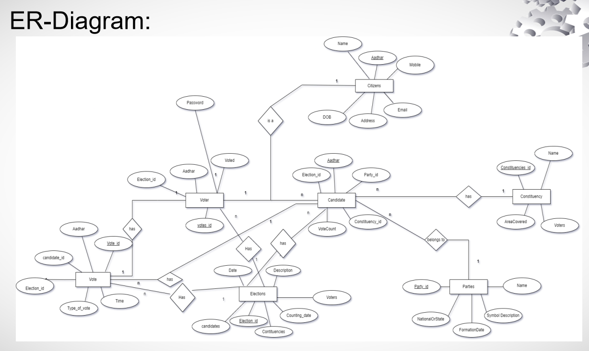

# Remote-Voting-System
 
 This project was designed as a part of the minor project for my college curriculum.
 It uses phpMyAdmin which is a free and open source administration tool for MySQL and MariaDB.
 
 
